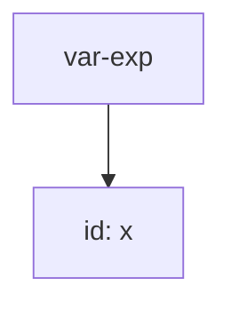
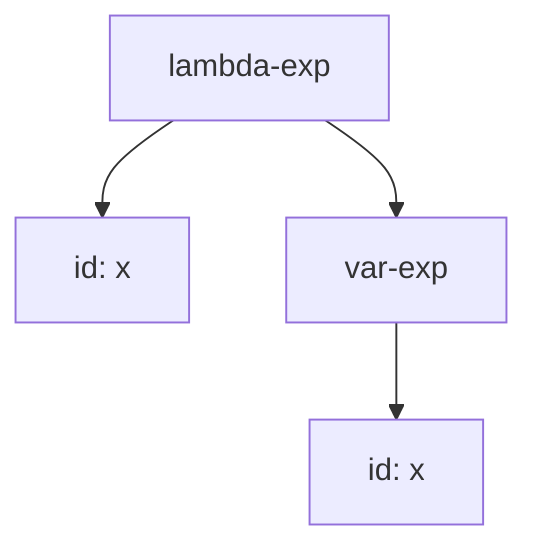
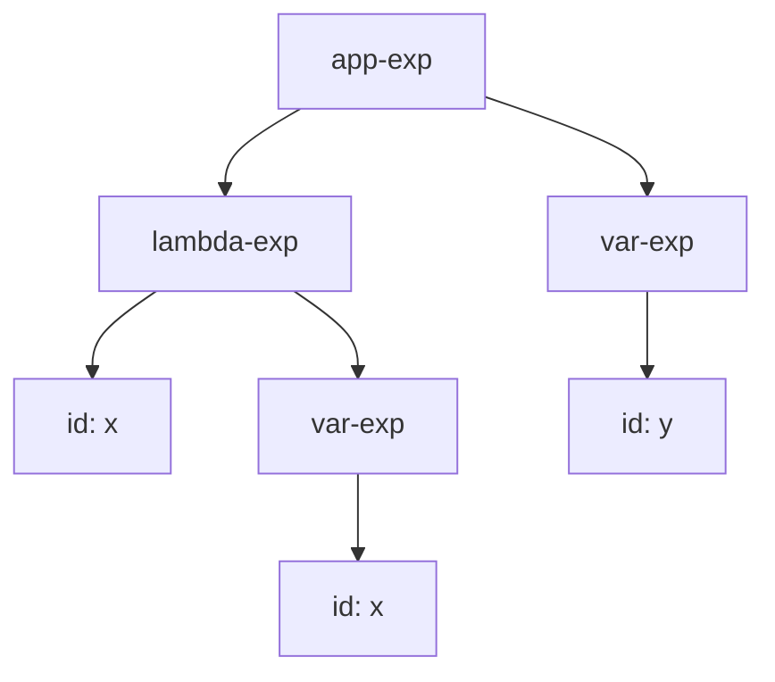
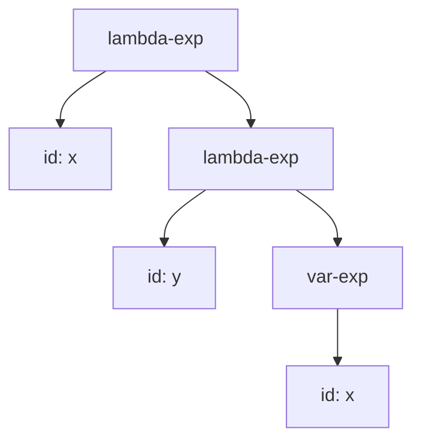
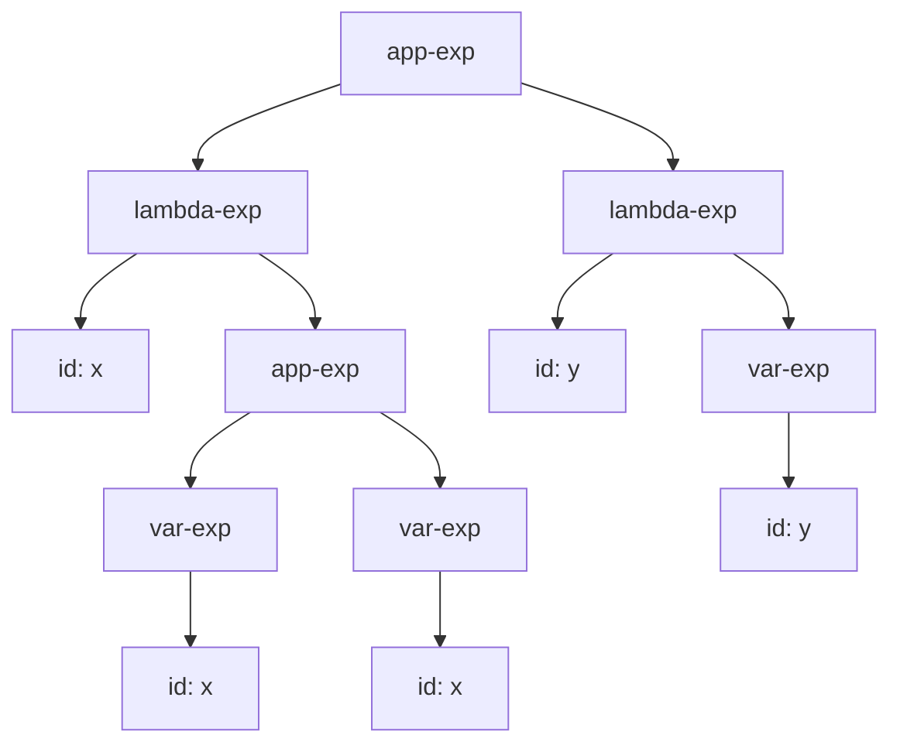

# Ejemplo de AST en expresiones

La gramática considerada es:

```bnf
<lc-exp> ::= <identifier>
           var-exp(id)
         ::= "lambda" "(" <identifier> ")" <lc-exp>
            lambda-exp(id, exp)
          ::= "(" <lc-exp> <lc-exp> ")"
            app-exp(rator, rand)
```

---

## Ejemplo 1: `x`



---

## Ejemplo 2: `(lambda (x) x)`



---

## Ejemplo 3: `((lambda (x) x) y)`



---

## Ejemplo 4: `(lambda (x) (lambda (y) x))`



---

## Ejemplo 5: `((lambda (x) (x x)) (lambda (y) y))`


